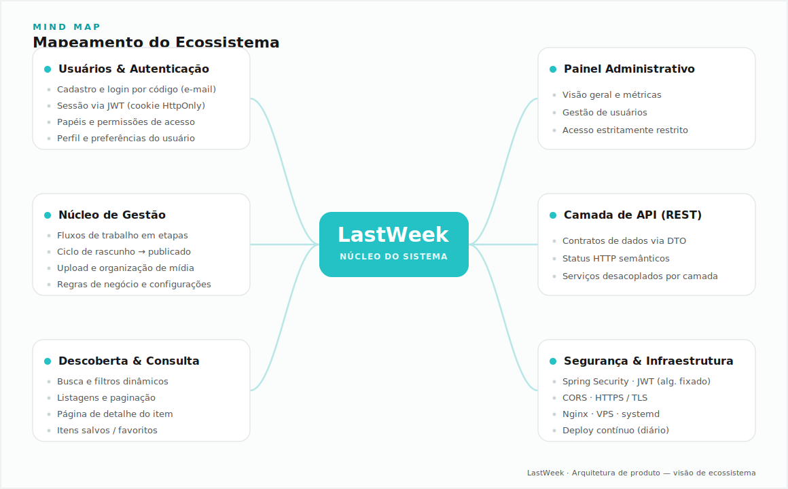
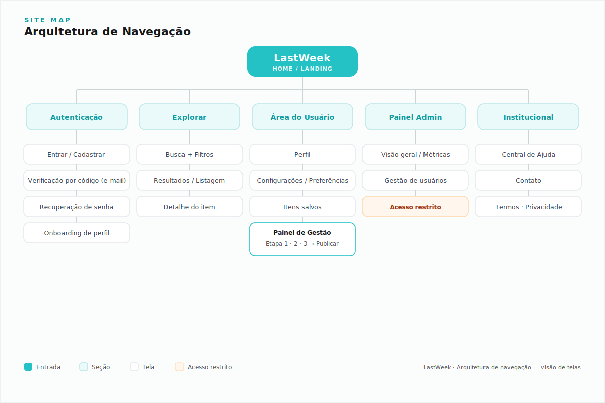

<h1 align="center">LastWeek</h1>

  <strong>Plataforma corporativa de gestão e produtividade semanal.</strong> 
  Engenharia de back-end, arquitetura de sistemas e gestão de projeto.

  
  
  

  
  
  
  
  
  
  
  

---

> ⚠️ **Aviso de Confidencialidade**
> Este repositório é uma **vitrine técnica (case de portfólio)** e **não contém o código-fonte** da aplicação.
> O LastWeek é um produto comercial em uso no mercado corporativo; o código é **privado** por questões de
> **propriedade intelectual, compliance e proteção de dados**. O objetivo aqui é documentar decisões de
> **arquitetura, engenharia e planejamento** do projeto.

---

## 🚀 Sobre o LastWeek

O **LastWeek** é uma plataforma web voltada à **gestão e produtividade em ciclos semanais**, projetada para
o contexto **corporativo**. O sistema centraliza operações recorrentes, organiza fluxos de trabalho e oferece
uma experiência fluida — do cadastro e autenticação de usuários até os painéis de acompanhamento e administração.

Sob a perspectiva de engenharia, o projeto foi concebido como uma **aplicação de produção real**: com foco em
**segurança**, **integridade de dados**, **escalabilidade** e **manutenibilidade** — e não como um protótipo
acadêmico. Cada decisão técnica prioriza a longevidade do software e a facilidade de evolução por um time.

> 🔒 Por se tratar de um sistema em ambiente produtivo e com dados sensíveis, o código permanece fechado.
> Esta página descreve **como** ele foi construído, sem expor **o que** o compõe internamente.

---

## 🌐 Link do Projeto

A aplicação está **no ar** e em **evolução contínua**:

### ➡️ **[www.lastweek.com.br](https://www.lastweek.com.br)**

> 🟢 **Ambiente vivo.** O produto está em **desenvolvimento ativo**, com um processo de **deploy contínuo (CI/CD)**
> que leva **novas funcionalidades e melhorias ao ar diariamente**. É esperado — e proposital — que a interface e
> o conjunto de features evoluam de um dia para o outro.

---

## 🛠️ Stack Tecnológica & Arquitetura

### Tecnologias principais

| Camada | Tecnologia |
| --- | --- |
| ☕ **Linguagem** | Java 17 |
| 🍃 **Framework** | Spring Boot (Spring Web, Spring Security, Spring Data JPA) |
| 🗄️ **Persistência** | Banco de dados relacional (SQL) com Hibernate / JPA |
| 🔐 **Autenticação** | Tokens JWT com sessão via cookie `HttpOnly` |
| 📦 **Build & Dependências** | Maven |
| 🌐 **Infraestrutura** | VPS Linux · Nginx (reverse proxy) · TLS/HTTPS · `systemd` |
| 🔧 **Versionamento** | Git / GitHub |

> O **front-end** é um **cliente web desacoplado (SPA)** que consome exclusivamente a **API REST** do back-end —
> reforçando a separação de responsabilidades entre camadas.

### Visão arquitetural

A arquitetura segue uma **organização em camadas (layered architecture)**, com fronteiras bem definidas e
**baixo acoplamento**, sustentada pela **injeção de dependências** nativa do Spring:

- **`controller`** — Exposição de **APIs RESTful**, orquestração de requisições/respostas e validação de entrada.
- **`service`** — Onde vive a **regra de negócio**. Camada independente de framework de transporte e de detalhes de persistência.
- **`repository`** — Acesso a dados via **Spring Data JPA**, abstraindo o banco relacional.
- **`entity` / `dto`** — Separação explícita entre o **modelo de domínio** e os **contratos de API** (DTOs),
  evitando o vazamento de estruturas internas e dados sensíveis para o cliente.
- **`config` / `security`** — Configuração transversal: segurança, CORS, filtros e políticas de acesso.

Princípios que norteiam essa organização:

- **API RESTful** com contratos previsíveis e status HTTP semânticos.
- **Injeção de Dependências** para inversão de controle e testabilidade.
- **Separação de responsabilidades** (SoC) entre transporte, negócio e dados.
- **DTOs como fronteira**, garantindo que a API exponha apenas o necessário.

---

## 🗺️ Engenharia de UX & Arquitetura de Informação

Antes de escrever a primeira linha de código, o projeto passou por uma etapa de **validação de escopo e design de
produto**. A premissa foi clara: **software bem construído começa por um entendimento sólido do problema e da
jornada do usuário** — não pela tecnologia.

### 🧠 Mind Map — Mapeamento do Ecossistema

Estruturação das entidades, atores, funcionalidades e regras de negócio do sistema, garantindo uma visão
holística antes da modelagem técnica.

  

### 🧭 Site Map — Arquitetura de Navegação

Definição da hierarquia de telas, fluxos de navegação e pontos de decisão do usuário, orientando o design de uma
experiência coesa e a modelagem das rotas da API.

  

> 💡 Essa etapa demonstra que o desenvolvimento foi **precedido por design intencional**, reduzindo retrabalho e
> alinhando a arquitetura de software à **usabilidade** desde a concepção.

---

## 🛡️ Boas Práticas e Engenharia de Software

O back-end foi desenvolvido com rigor de **software de produção**, aplicando princípios consolidados da engenharia:

- 🧼 **Clean Code** — Nomenclatura expressiva, funções coesas e código legível, pensado para leitura e manutenção por um time.
- 🧱 **Princípios SOLID** — Responsabilidade única por camada/classe, inversão de dependências e baixo acoplamento como norte de design.
- 🚨 **Tratamento consistente de exceções** — Respostas de erro padronizadas e previsíveis, sem vazamento de detalhes internos (stack traces) para o cliente.
- ✅ **Validação de dados** — Uso de **Bean Validation** para garantir a integridade das entradas na fronteira da aplicação, falhando cedo e de forma clara.
- 🔐 **Segurança** — Autenticação baseada em **JWT** com cookies `HttpOnly`, algoritmo de assinatura fixado (mitigando ataques de confusão de algoritmo), configuração explícita de **CORS** e controle de acesso por rota.
- ⚡ **Performance & integridade em SQL** — Modelagem relacional com foco em **consultas eficientes**, uso de índices, projeções (DTOs) para evitar over-fetching e proteção contra SQL Injection via consultas parametrizadas do JPA.
- 🌍 **Prontidão para produção** — HTTPS, variáveis de ambiente para segredos (nunca versionados), reverse proxy e serviço gerenciado por `systemd`.

---

## 📈 Status de Desenvolvimento

  
  

O LastWeek é um **produto vivo**, mantido sob uma dinâmica de **entregas incrementais e frequentes**:

- 🔁 **Deploys diários** — Novas features e refinamentos são publicados em produção de forma contínua.
- 🧩 **Evolução incremental** — O produto cresce em ciclos curtos, priorizando valor entregue e feedback real de uso.
- 🛠️ **Melhoria contínua** — Refatorações, endurecimento de segurança e otimizações de performance fazem parte da rotina.

> 🚧 Este projeto **não está "finalizado"** — e essa é a intenção. Ele reflete um processo de engenharia contínuo,
> mais próximo da realidade de um produto de mercado do que de um trabalho pontual.

---

## 👤 Autor

Desenvolvido e arquitetado por **Eric Beltrão** — responsável pela **infraestrutura back-end**, **arquitetura de
software** e **gestão do projeto** do LastWeek.

  <a href="https://www.lastweek.com.br">🌐 Aplicação</a> ·
  <a href="https://www.linkedin.com/in/ericbeltrao">💼 LinkedIn</a> ·
  <a href="https://github.com/ericbeltraoo">🐙 GitHub</a>

© LastWeek — Código-fonte proprietário. Este repositório é uma vitrine técnica para fins de portfólio.

